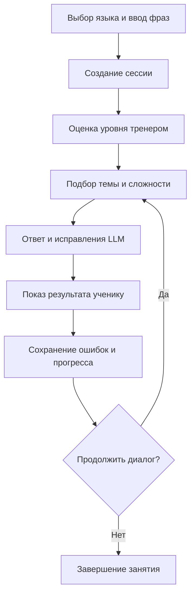
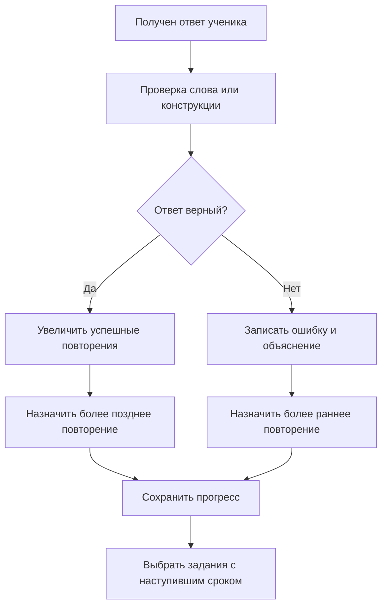
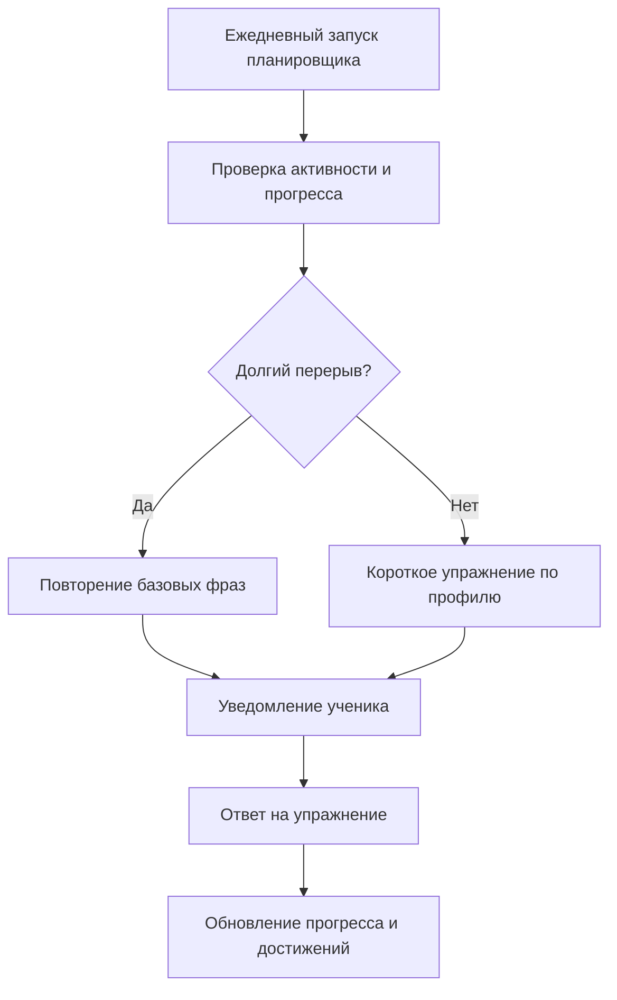

# Vision: LinguaBot — агент-учитель языка

**Версия:** 1.0  
**Назначение документа:** согласовать цель, границы, ключевые процессы и требования к системе.  
**Основание:** тема «Агент-учитель языка (LinguaBot)» из приложенного перечня проектов. Количественные показатели и детали интерфейсов ниже являются предлагаемыми критериями для учебного проекта, а не дословными требованиями исходной темы.

## 1. Общее описание

LinguaBot — персональный собеседник для практики иностранного языка. Пользователь выбирает английский, испанский или немецкий и общается с ИИ. Система оценивает его текущий уровень (A1–C1), подбирает лексику, исправляет ошибки с кратким объяснением и возвращает сложные слова и конструкции в последующих упражнениях. Прогресс, типичные ошибки и достижения сохраняются между занятиями.

**Проблема:** обычный диалог с языковой моделью не ведёт устойчивый профиль ученика и не планирует повторение его ошибок.  
**Цель:** сделать регулярную языковую практику персональной: каждое занятие опирается на уровень, прошлые ответы и историю повторений пользователя.  
**Основной пользователь:** человек, изучающий один из трёх поддерживаемых языков.  
**Граница системы:** LinguaBot отвечает за текстовую практику, профиль, упражнения, прогресс и напоминания. Голосовой ввод, проверка произношения, платежи и социальные функции не входят в первоначальный объём.

### Состав системы

| Компонент | Ответственность | Предполагаемая технология из темы |
| --- | --- | --- |
| Клиентский интерфейс | Выбор языка, диалог, упражнения, просмотр прогресса | Веб- или другой текстовый клиент; в теме не задан |
| Сервер приложения | REST API, сессии диалога, правила выдачи достижений, планировщик | Java Spring Boot / Spring Scheduler |
| Агент-тренер | Анализ ответов, оценка уровня, подбор сложности | Python, NLTK/spaCy |
| LLM-агент-собеседник | Ответ на изучаемом языке, предложение исправлений и объяснений | Python и подключаемая LLM |
| Модуль повторения | Выбор слов и ошибок, расчёт следующей даты повторения | Python или Java |
| Хранилище | Профили, словарь, ошибки, диалоги, повторения и достижения | PostgreSQL, в том числе JSONB |

## 2. Краткое содержание

1. Пользователь выбирает язык и начинает занятие.
2. Агент-тренер анализирует ответы и уточняет уровень A1–C1.
3. Собеседник ведёт диалог в пределах подходящей сложности и объясняет значимые ошибки.
4. Система сохраняет ошибки, новые слова и результаты упражнений; модуль интервального повторения назначает следующие задания.
5. За выполненные действия начисляется прогресс и выдаются достижения; планировщик предлагает короткое ежедневное упражнение и напоминает о повторении после долгого перерыва.

**Критерий успешного сценария:** пользователь может продолжить обучение в новой сессии, а бот использует его сохранённый уровень и хотя бы одну ранее допущенную ошибку или слово для персонального повторения.

## 3. Функциональные и нефункциональные требования

### 3.1. Функциональные требования

| ID | Требование | Проверяемый результат |
| --- | --- | --- |
| FR-01 | Пользователь выбирает изучаемый язык: английский, испанский или немецкий. | Выбранный язык хранится в профиле и используется в диалоге и упражнениях. |
| FR-02 | Система создаёт и сохраняет профиль ученика с уровнем A1–C1 и темами занятий. | После повторного входа профиль доступен. |
| FR-03 | В начале обучения агент-тренер анализирует несколько текстовых ответов: длину фраз, используемую грамматику и ошибки; начальный уровень остаётся предварительной оценкой. | Определён уровень и его можно пересмотреть после новых ответов. |
| FR-04 | Во время диалога система подбирает вопросы и словарь по текущему уровню. | В следующем ответе учитываются язык, уровень и тема. |
| FR-05 | LLM-агент ведёт связный текстовый диалог и предлагает исправление найденной ошибки с коротким объяснением. | Пользователь видит ответ, исправленный вариант и объяснение, когда ошибка обнаружена. |
| FR-06 | Система сохраняет типичные ошибки, изучаемые слова и историю повторений по конкретному пользователю. | Данные сохраняются между сессиями и не смешиваются между пользователями. |
| FR-07 | Модуль повторения назначает упражнения на слова и конструкции с учётом числа повторений, ошибок и результата последнего ответа. | После ответа изменяются результат и дата следующего повторения. |
| FR-08 | Пользователь выполняет короткое упражнение и получает обратную связь по ответу. | Показаны правильный вариант и обновлённый прогресс. |
| FR-09 | Система показывает статистику: изученные слова, текущий уровень и достижения. | Статистика обновляется после завершения занятия или упражнения. |
| FR-10 | Планировщик создаёт ежедневное упражнение и напоминание при длительном отсутствии активности. | Пользователь получает предложение занятия через выбранный канал уведомлений. |

### 3.2. Нефункциональные требования

| ID | Требование | Предлагаемый способ проверки |
| --- | --- | --- |
| NFR-01 | Данные разных пользователей изолированы; доступ к профилю и истории требует авторизации. | Запрос к чужому профилю отклоняется. |
| NFR-02 | Соединения клиента с сервером и сервера с внешней LLM защищены TLS; секреты интеграций не хранятся в исходном коде. | Проверка конфигурации развёртывания. |
| NFR-03 | При недоступности LLM приложение сообщает о временной ошибке, сохраняет состояние занятия и допускает повторную попытку. | Смоделировать ошибку/тайм-аут LLM без потери уже записанного прогресса. |
| NFR-04 | Обычные операции с профилем и прогрессом выполняются не дольше 2 секунд при учебной нагрузке; ответ LLM может занимать дольше, при ожидании отображается статус. | Измерение времени для заданного демонстрационного набора пользователей. |
| NFR-05 | Всякое изменение прогресса сохраняется атомарно, чтобы повторный запрос не удваивал результат упражнения. | Повторить запрос с тем же идентификатором попытки. |
| NFR-06 | В интерфейсе видно, что уровень оценивается приблизительно, а ответы ИИ могут содержать ошибки; пользователь может очистить свою историю. | Проверка интерфейса и операции удаления. |
| NFR-07 | Логи диагностики не содержат ключей API и полного текста личных диалогов. | Просмотр логов после тестовой сессии. |

## 4. Требования к взаимодействиям и интеграциям

| Стороны | Направление и данные | Условие/результат |
| --- | --- | --- |
| Клиент ↔ Spring Boot | REST/JSON: профиль, выбранный язык, сообщения, ответы на упражнения, прогресс. | Сервер проверяет пользователя и входные данные; возвращает понятные ошибки и состояние операции. |
| Spring Boot ↔ Python-сервисы | Внутренний HTTP/JSON: язык, уровень, тема, ограниченный контекст диалога, ответ пользователя; обратно — оценка, реплика, исправления и признаки ошибок. | Согласованные схемы запросов/ответов, идентификатор сессии, тайм-аут и обработка недоступности. |
| Python-сервис ↔ LLM | Запрос с инструкцией и необходимым контекстом; ответ модели с текстом и предложенными исправлениями. | Ключ доступа хранится в конфигурации; ответ проверяется перед записью в профиль. Поставщик может быть внешним или локальным. |
| Приложение ↔ PostgreSQL | Чтение и запись профилей, слов, ошибок, занятий, повторений и достижений. | Связь записей с пользователем; транзакции для изменения прогресса. |
| Планировщик ↔ канал уведомлений | Задание/напоминание, язык, дата отправки, идентификатор пользователя. | Канал определяется при реализации (например, уведомление внутри приложения или email); сбой отправки не удаляет само упражнение. |

**Предлагаемая модель данных.** Отдельные записи хранят пользователей, занятия и ошибки; для истории повторений допустима указанная в теме ECS-подобная структура плоских массивов `word_ids`, `times_repeated`, `error_counts`. Элементы одинаковых индексов относятся к одному слову; дополнительно нужна дата следующего повторения. Гибкие сведения о словах и темах могут храниться в PostgreSQL `JSONB`. Упомянутые в теме бинарные векторы слов по уровню сложности можно использовать для быстрой фильтрации слов; их точный формат определяется при проектировании БД. Система не должна полагаться на ответ LLM как на единственный источник состояния прогресса.

## 5. Ключевые процессы

### 5.1. Первое занятие и диалог

Пользователь выбирает язык и пишет несколько фраз. Сервер создаёт сессию, тренер предварительно оценивает уровень, после чего собеседник получает тему, уровень и минимально необходимый контекст. Пользователь видит реплику, исправления и краткое объяснение. Подтверждённые результаты записываются в профиль; при дальнейших ответах оценка уровня уточняется.

### 5.2. Интервальное повторение

После ответа система фиксирует, какое слово или конструкция вызвали затруднение. Модуль повторения выбирает материал, срок которого наступил, и выдаёт короткое упражнение. Правильный ответ увеличивает число успешных повторений и отодвигает следующее упражнение; ошибка увеличивает счётчик ошибок и назначает более раннее повторение. Точные интервалы задаются при реализации алгоритма.

### 5.3. Ежедневное задание и возвращение пользователя

Планировщик проверяет дату последней активности и сроки повторения. Он готовит короткое упражнение на изучаемом языке. Если пользователь долго не занимался, вместо обычного задания предлагается повторение базовых фраз. После прохождения задания статистика и достижения обновляются. Порог неактивности и время доставки настраиваются при реализации.

## 6. Границы первой версии и открытые решения

Для первой рабочей версии достаточно текстового клиента, одного профиля на пользователя, трёх указанных языков, диалога, сохранения ошибок, простого алгоритма повторения, статистики и уведомления внутри приложения. Внешний email/push, сложная оценка грамматики и бинарные векторы можно добавить после проверки базового сценария; при этом архитектура и модель данных должны допускать их подключение.

До реализации нужно выбрать поставщика или локальную модель LLM, способ авторизации, конкретный канал уведомлений, порог «долгого перерыва» и формулу интервалов повторения. Эти варианты не указаны однозначно в исходной теме.
